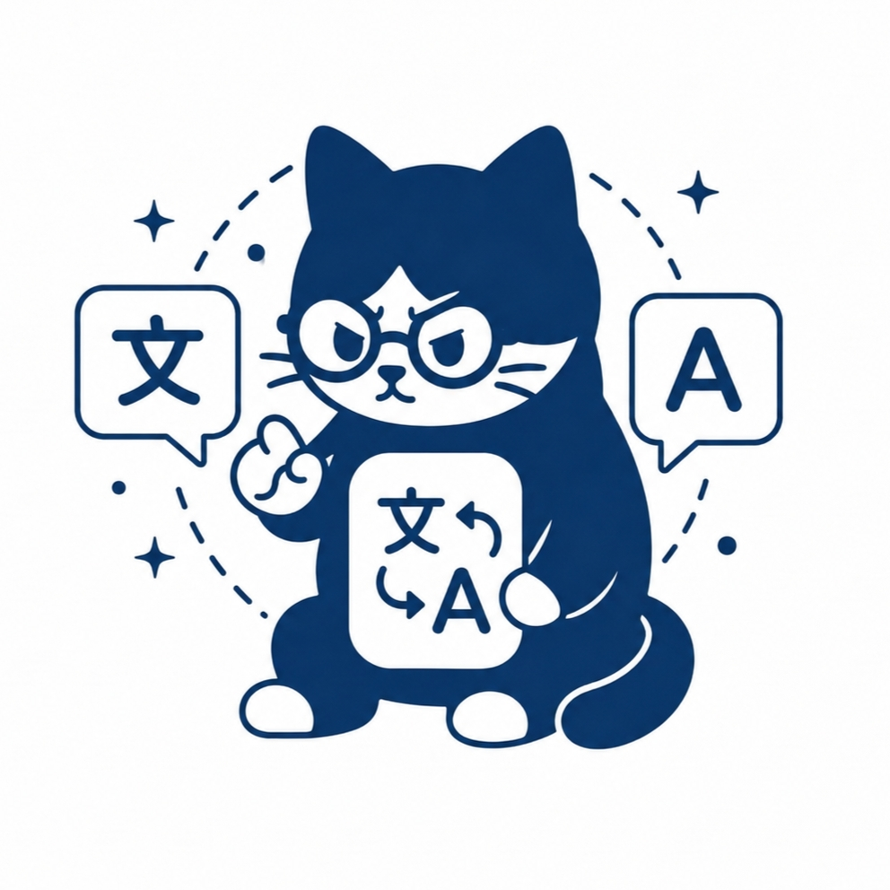

<div align="center">
  

  <h1>Screen Translator</h1>

  <p><strong>Terjemahkan teks di layar Android langsung di atas konten yang sedang dibaca.</strong></p>
  <p>Cocok untuk manga, manhwa, manhua, komik, novel visual, game, dan aplikasi berbahasa asing.</p>

  <p>
    
    
    
    
    
  </p>
</div>

---

Screen Translator adalah aplikasi Android yang menangkap layar, mengenali teks menggunakan OCR, menerjemahkannya, lalu menampilkan hasil sebagai bubble overlay di atas teks asli. Proses dapat berjalan otomatis setelah pengguna berhenti menyentuh atau menggulir layar, sehingga membaca konten asing terasa lebih natural tanpa bolak-balik mengambil screenshot dan membuka aplikasi penerjemah.

Aplikasi menyediakan dua jalur terjemahan: mode offline berbasis Google ML Kit dan mode online melalui provider AI. OCR tetap dijalankan di perangkat, sementara pengguna bebas menentukan keseimbangan antara privasi, kecepatan, dan kualitas terjemahan.

## Daftar Isi

- [Fitur Utama](#fitur-utama)
- [Cara Kerja](#cara-kerja)
- [Bahasa dan Model OCR](#bahasa-dan-model-ocr)
- [Mode Terjemahan](#mode-terjemahan)
- [Smart Model Manager](#smart-model-manager)
- [Kustomisasi Overlay](#kustomisasi-overlay)
- [Persyaratan](#persyaratan)
- [Instalasi untuk Pengguna](#instalasi-untuk-pengguna)
- [Cara Menggunakan](#cara-menggunakan)
- [Permission yang Dibutuhkan](#permission-yang-dibutuhkan)
- [Build dari Source](#build-dari-source)
- [Konfigurasi Provider Online](#konfigurasi-provider-online)
- [Arsitektur Teknis](#arsitektur-teknis)
- [Privasi dan Keamanan](#privasi-dan-keamanan)
- [Troubleshooting](#troubleshooting)
- [Kontribusi dan Lisensi](#kontribusi-dan-lisensi)

## Fitur Utama

### Terjemahan langsung di atas layar

Hasil terjemahan digambar sebagai bubble overlay yang mengikuti posisi teks hasil OCR. Pengguna dapat tetap berada di aplikasi pembaca, browser, atau game yang sedang digunakan.

### Deteksi otomatis saat layar diam

Accessibility Service memantau aktivitas layar. Setelah pengguna berhenti menggulir atau menyentuh layar selama jeda yang ditentukan, aplikasi otomatis memulai proses capture dan terjemahan.

### OCR multi-aksara

Google ML Kit Text Recognition digunakan untuk mengenali:

- Latin dan Inggris
- Jepang
- Korea
- Tiongkok
- Devanagari/Hindi

Mode Auto Detect mencoba memilih jalur OCR yang sesuai dan menggunakan model yang tersedia tanpa selalu memuat semua recognizer sekaligus.

### Smart OCR block merging

Potongan OCR yang sebenarnya berasal dari satu dialog dapat digabung menjadi satu kelompok berdasarkan jarak vertikal, jarak horizontal, dan kemiripan ukuran teks. Hasilnya mengurangi bubble bertumpuk dan menjaga efek suara berukuran besar agar tidak sembarang digabung dengan dialog kecil.

### Offline dan online

- Mode offline menggunakan model terjemahan Google ML Kit di perangkat.
- Mode online mendukung Default Translator, OpenAI-compatible API, dan Google Gemini.
- Ketika koneksi terputus, aplikasi dapat beralih ke jalur offline jika model yang diperlukan tersedia.

### Smart Model Manager

Status model bahasa dapat dilihat dari layar utama. Model terjemahan yang belum tersedia bisa diunduh sekaligus, dengan status proses dan notifikasi unduhan.

### Floating control ball

Kontrol mengambang menyediakan akses cepat untuk pause atau melanjutkan proses tanpa harus kembali ke aplikasi utama. Ukurannya dapat disesuaikan melalui Settings.

### UI dan pengalaman penggunaan

- Material Design 3
- Tema Light, Dark, dan mengikuti sistem
- Antarmuka aplikasi dalam bahasa Inggris dan Indonesia
- Splash screen ringan berbasis VectorDrawable
- State tombol Start yang tahan klik berulang
- Pembersihan overlay otomatis ketika layar kembali bergerak
- Penanganan crash global dengan tampilan laporan error lokal

## Cara Kerja

```text
Layar berhenti bergerak
        |
        v
Accessibility Service mengirim trigger
        |
        v
MediaProjection mengambil frame layar
        |
        v
ML Kit OCR mengenali teks dan posisi
        |
        v
Smart Merge mengelompokkan potongan OCR
        |
        +------ Mode Offline ------> ML Kit Translation
        |
        +------ Mode Online -------> Provider API terpilih
        |
        v
Overlay menampilkan hasil di atas konten asli
```

Pekerjaan berat dijalankan dengan Kotlin Coroutines di luar main thread. Operasi ML Kit juga dilindungi timeout dan pembatalan agar hasil dari capture lama tidak muncul setelah pengguna kembali menggulir layar.

## Bahasa dan Model OCR

| Pilihan sumber | Aksara OCR | Keterangan |
|---|---|---|
| Auto Detect | Model yang tersedia | Memilih/fallback berdasarkan hasil dan konfigurasi |
| Japanese | Jepang | Cocok untuk manga dan novel visual Jepang |
| Korean | Korea | Cocok untuk manhwa dan aplikasi Korea |
| Chinese | Tiongkok | Cocok untuk manhua dan teks Mandarin |
| Devanagari | Devanagari | Untuk Hindi dan bahasa beraksara Devanagari |
| Latin/English | Latin | Untuk Inggris dan banyak bahasa beraksara Latin |

Bahasa target memakai daftar bahasa yang didukung ML Kit Translation. Bahasa target default adalah Indonesia.

## Mode Terjemahan

### Mode Offline

OCR, identifikasi bahasa, dan terjemahan dijalankan di perangkat. Internet hanya diperlukan saat modul OCR atau model terjemahan pertama kali diunduh.

Kelebihan:

- Teks tidak perlu dikirim ke provider AI eksternal
- Tetap dapat digunakan tanpa internet setelah model tersedia
- Tidak membutuhkan API key
- Latensi lebih konsisten

Catatan: kualitas terjemahan bergantung pada pasangan bahasa dan kemampuan model ML Kit.

### Mode Online

OCR tetap dilakukan di perangkat, tetapi teks hasil OCR dikirim ke provider yang dipilih untuk diterjemahkan secara batch.

Provider yang tersedia:

- Default Translator
- OpenAI atau endpoint yang kompatibel dengan format Chat Completions
- Google Gemini

Mode ini cocok ketika dibutuhkan terjemahan yang lebih kontekstual, khususnya untuk dialog komik. Koneksi internet diperlukan dan kebijakan privasi provider eksternal berlaku.

## Smart Model Manager

Aplikasi membedakan dua jenis komponen ML:

1. **Modul OCR** untuk membaca bentuk tulisan dari gambar. Modul tipis disediakan melalui Google Play Services.
2. **Model Translation** untuk menerjemahkan bahasa secara offline. Model ini dikelola melalui ML Kit `RemoteModelManager`.

Manager akan:

- Memeriksa model bahasa yang sudah terpasang
- Menampilkan status Installed atau Not Installed
- Mengunduh model yang masih kurang
- Menampilkan progres melalui UI dan notifikasi Android
- Menyimpan status model untuk membantu Auto Detect memilih jalur yang relevan

Ukuran setiap model berbeda. Pastikan perangkat memiliki ruang penyimpanan dan koneksi yang stabil saat unduhan pertama.

## Kustomisasi Overlay

Settings menyediakan kontrol berikut:

| Pengaturan | Fungsi |
|---|---|
| Inactivity delay | Jeda sebelum capture otomatis dimulai |
| Placement | Menempatkan bubble langsung, di kiri, atau di kanan teks |
| Bubble opacity | Mengatur transparansi latar bubble |
| Corner radius | Mengatur lengkungan sudut bubble |
| Text size | Mengatur ukuran teks secara manual |
| Auto Text Fit | Menyesuaikan ukuran teks terhadap area OCR |
| Background color | Menentukan warna latar bubble |
| Text color | Menentukan warna teks terjemahan |
| Auto Detect Text Color | Mengikuti perkiraan warna tulisan dari gambar |
| Bubble border | Menampilkan atau menyembunyikan garis bubble |
| Transparent Mode | Menampilkan teks tanpa latar bubble solid |
| Outline color/thickness | Menjaga teks terbaca pada Transparent Mode |
| Auto Rotate Canvas | Mengikuti orientasi teks hasil OCR |
| Smart Eraser | Mengambil sampel warna sekitar untuk menutup teks asli |
| Smart Merge tolerance | Mengatur sensitivitas penggabungan blok OCR |
| Auto clear | Menghapus overlay setelah durasi tertentu |
| Floating ball size | Mengatur ukuran kontrol pause/play mengambang |

## Persyaratan

- Android 7.0 atau lebih baru, API 24+
- Google Play Services untuk pengiriman modul OCR tipis
- Dukungan tampil di atas aplikasi lain
- Accessibility Service yang diaktifkan pengguna
- Persetujuan screen capture melalui MediaProjection
- Internet untuk download model pertama dan mode online

Perangkat Android tanpa Google Play Services mungkin tidak dapat mengunduh atau menjalankan seluruh modul OCR yang dibutuhkan.

## Instalasi untuk Pengguna

1. Unduh APK yang sesuai dengan arsitektur perangkat.
2. Izinkan instalasi dari sumber yang digunakan untuk membuka APK jika Android memintanya.
3. Instal dan buka Screen Translator.
4. Berikan permission yang ditampilkan pada layar utama.
5. Pilih bahasa sumber, bahasa target, serta mode Offline atau Online.
6. Download model yang diperlukan melalui bagian AI Models.
7. Tekan Start dan setujui dialog screen recording Android.

Build release menghasilkan APK berikut:

- `arm64-v8a` untuk mayoritas perangkat Android modern
- `armeabi-v7a` untuk perangkat ARM 32-bit
- `x86` dan `x86_64` untuk perangkat/emulator terkait
- `universal` untuk APK yang kompatibel dengan seluruh ABI di atas

Jika tidak mengetahui ABI perangkat, gunakan APK universal.

## Cara Menggunakan

1. Buka aplikasi dan selesaikan indikator permission.
2. Pilih bahasa sumber atau gunakan Auto Detect.
3. Pilih bahasa tujuan.
4. Gunakan Offline untuk privasi dan penggunaan tanpa jaringan, atau Online untuk provider AI.
5. Pastikan model offline sudah berstatus Installed jika memakai mode Offline.
6. Tekan tombol Start Service.
7. Setujui izin perekaman layar pada dialog sistem.
8. Buka manga, komik, game, atau aplikasi target.
9. Berhenti menggulir sejenak sampai terjemahan muncul.
10. Gunakan floating ball untuk pause atau melanjutkan layanan.

Overlay lama akan dibersihkan ketika layar bergerak. Service juga dapat dihentikan melalui aplikasi atau tombol Stop pada notifikasi foreground.

## Permission yang Dibutuhkan

| Permission/akses | Alasan |
|---|---|
| Display over other apps | Menggambar bubble terjemahan di atas aplikasi lain |
| Accessibility Service | Mendeteksi scroll, sentuhan, perpindahan layar, dan kondisi tidak aktif |
| Screen recording | Mengambil gambar layar melalui MediaProjection setelah persetujuan pengguna |
| Foreground service | Menjaga proses capture aktif dan terlihat oleh pengguna |
| Notifications | Menampilkan status service dan proses download model pada Android 13+ |
| Internet | Download model, pemeriksaan jaringan, dan terjemahan online |
| Network state | Mendeteksi koneksi untuk fallback offline |

Aplikasi tidak dapat memberikan permission sensitif tersebut secara otomatis. Pengguna tetap mengaktifkan dan menyetujui setiap akses melalui UI Android.

## Build dari Source

### Toolchain

- JDK 17
- Android Studio dengan Android SDK 34
- Gradle Wrapper dari repository
- Perangkat atau emulator Android API 24+

### Clone dan build debug

```bash
git clone https://github.com/HamzahSk/app-translator.git
cd app-translator
./gradlew assembleDebug
```

APK debug tersedia di bawah `app/build/outputs/apk/debug/`.

### Pemeriksaan kualitas

```bash
./gradlew spotlessCheck lintRelease
```

Untuk memperbaiki format Kotlin secara otomatis:

```bash
./gradlew spotlessApply
```

### Build release

```bash
./gradlew assembleRelease
```

Release build mengaktifkan R8, resource shrinking, dan Split APK per ABI. Tanpa konfigurasi signing eksternal, build lokal menggunakan debug signing agar artefak tetap dapat diuji. Jangan gunakan debug key untuk distribusi production.

Untuk signing berbasis environment, konfigurasi build membaca:

```text
SIGNING_KEY
KEY_STORE_PASSWORD
ALIAS
KEY_PASSWORD
```

Keystore production tidak disimpan di repository.

## Konfigurasi Provider Online

### OpenAI-compatible

Isi pengaturan berikut di aplikasi:

- Provider: OpenAI
- API Base URL: URL endpoint provider
- API Key: token provider
- Model: nama model yang tersedia pada provider

Implementasi memakai format Chat Completions melalui Retrofit/OkHttp. Endpoint kompatibel dapat digunakan selama struktur request dan response sesuai.

### Google Gemini

Pilih provider Gemini, kemudian masukkan API key dan nama model Gemini yang ingin digunakan. Request dikirim melalui endpoint `generateContent`.

### Default Translator

Provider Default tidak membutuhkan kolom API key atau base URL. Mode ini tetap membutuhkan jaringan.

Jangan menaruh API key langsung di source code atau commit repository. Konfigurasi provider disimpan sebagai preferensi aplikasi pada perangkat.

## Arsitektur Teknis

```text
com.rocat.translator
|- MainActivity                     UI utama, permission, mode, dan model manager
|- ScreenCaptureService             Foreground MediaProjection service
|- InactivityAccessibilityService   Trigger otomatis dan pembersihan overlay
|- TranslationEngine                OCR, identifikasi, merge, dan translation flow
|- OverlayManager                   Rendering dan lifecycle bubble overlay
|- ConfigManager                    Preferensi pengguna
|- I18nManager                      Katalog bahasa aplikasi
|- GlobalExceptionHandler           Penyimpanan laporan crash lokal
|- ui.dialogs
|  `- SettingsDialog                Konfigurasi overlay dan OCR
`- online
   |- OnlineTranslator              Orkestrasi terjemahan online
   |- DefaultScraperTranslator      Provider default
   |- AiApiClient                   Konfigurasi Retrofit/OkHttp
   |- AiApiService                  Definisi endpoint
   `- AiApiModels                   Model request/response
```

Komponen utama:

- **MediaProjection** mengambil frame layar setelah persetujuan pengguna.
- **AccessibilityService** mengirim event capture setelah inactivity delay.
- **ML Kit Text Recognition** membaca teks dan koordinatnya.
- **ML Kit Language ID** membantu menentukan bahasa sumber.
- **ML Kit Translation** menangani terjemahan offline.
- **Retrofit, Gson, dan OkHttp** menangani provider online.
- **Kotlin Coroutines** menjaga OCR, bitmap, model, dan network work di luar UI thread.
- **OverlayManager** menggambar hasil, loading state, border, rotasi, dan warna.

## Privasi dan Keamanan

Pada mode Offline, pemrosesan OCR dan terjemahan dilakukan di perangkat setelah model tersedia. Pada mode Online, teks hasil OCR dikirim ke provider yang dipilih; pengguna perlu membaca kebijakan privasi provider tersebut sebelum memasukkan API key atau menerjemahkan konten sensitif.

Beberapa hal yang perlu diketahui:

- Aplikasi tidak merekam layar tanpa persetujuan MediaProjection dari dialog Android.
- Foreground notification ditampilkan selama service capture aktif.
- API key provider disimpan pada preferensi aplikasi lokal.
- Laporan crash lokal dapat berisi stack trace dan informasi perangkat untuk diagnosis.
- Network Security Config digunakan oleh aplikasi; gunakan hanya endpoint API yang dipercaya.

## Troubleshooting

### Terjemahan tidak muncul

- Pastikan semua indikator permission pada layar utama sudah aktif.
- Pastikan Start Service telah ditekan dan dialog screen recording disetujui.
- Periksa apakah floating control sedang dalam keadaan pause.
- Tingkatkan inactivity delay jika capture terjadi saat layar masih bergerak.
- Pastikan aplikasi target tidak memblokir screen capture melalui `FLAG_SECURE`.

### Model berstatus Not Installed

- Aktifkan internet dan Google Play Services.
- Tekan Download All pada bagian model.
- Tunggu notifikasi selesai sebelum memulai mode Offline.
- Pastikan ruang penyimpanan perangkat masih cukup.

### Mode online gagal

- Periksa koneksi internet.
- Pastikan API key, base URL, dan nama model benar.
- Pastikan endpoint kompatibel dengan provider yang dipilih.
- Periksa kuota, billing, rate limit, dan izin model pada akun provider.
- Jika model offline tersedia, aplikasi dapat memakai fallback saat jaringan terputus.

### Overlay sulit dibaca

- Aktifkan Auto Text Fit.
- Ubah opacity dan warna bubble.
- Pada Transparent Mode, tingkatkan ketebalan atau ubah warna outline.
- Aktifkan Auto Detect Text Color atau Smart Eraser sesuai jenis halaman.
- Sesuaikan toleransi Smart Merge jika bubble terlalu sering terpisah atau menyatu.

### Build gagal karena Java

Pastikan JDK 17 aktif:

```bash
java -version
```

Atur `JAVA_HOME` ke lokasi JDK 17, lalu jalankan ulang Gradle Wrapper.

## Status Proyek

Versi saat ini: **1.1.3** (`versionCode 9`)

Target teknis:

- `minSdk 24`
- `targetSdk 34`
- `compileSdk 34`
- Java/Kotlin JVM target 17
- R8 dan resource shrinking aktif pada release

Riwayat perubahan tersedia di [CHANGELOG.md](CHANGELOG.md).

## Kontribusi dan Lisensi

Kontribusi untuk perbaikan OCR, overlay, kompatibilitas perangkat, bahasa aplikasi, dokumentasi, dan provider translation dipersilakan. Baca [CONTRIBUTING.md](CONTRIBUTING.md) sebelum mengirim perubahan.

Proyek ini dirilis di bawah [MIT License](LICENSE).
